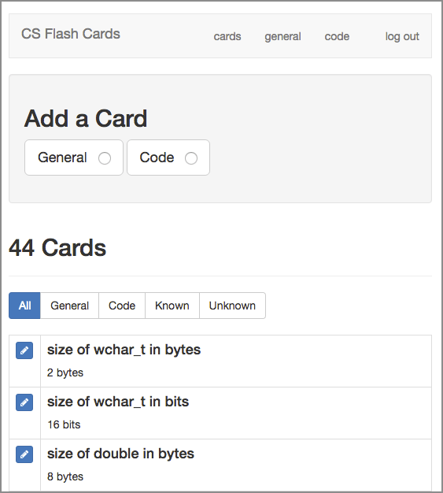
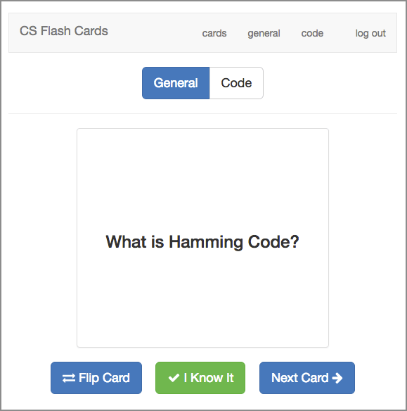
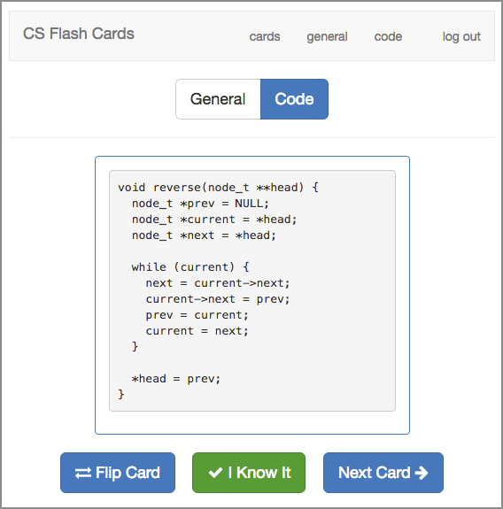

# Computer Science Flash Cards

This is a little website I've put together to allow me to easily make flash cards and quiz myself for memorization of:

- General cs knowledge
  - vocabulary
  - definitions of processes
  - powers of 2
  - design patterns
- Code
  - data structures
  - algorithms
  - solving problems
  - bitwise operations

Will be able to use it on:

- desktop
- mobile (phone and tablet)

It uses:

- Python 3
- Flask
- SQLite

---

## About the Site

Here's a brief rundown: https://startupnextdoor.com/flash-cards-site-complete/

## Screenshots

UI for listing cards. From here you can add and edit cards.



---

The front of a General flash card.



---

The reverse (answer side) of a Code flash card.



## Important Note

The set included in this project (**cards-jwasham.db**) is not my full set, and is way too big already.

Thanks for asking for my list of 1,792 cards. But **it’s too much.** I even printed them out. It’s 50 pages, front and back, in tiny text. It would take about 8 hours to just read them all.

My set includes a lot of obscure info from books I’ve read, Python trivia, machine learning knowledge, assembly language, etc.

I've added it to the project if you want it (**cards-jwasham-extreme.db**). You've been warned.

Please make your own set, and while you’re making them, only make cards for what you need to know. Otherwise, it gets out of hand.

## How to convert to Anki or CSV

If you don't want to run a server, you can simply use Anki or a similar service/app. Use this script to convert from my sets (SQLite .db file), or yours, to CSV:

https://github.com/eyedol/tools/blob/master/anki_data_builder.py

Thanks [@eyedol](https://github.com/eyedol)

## Anki Flashcards:

* [computer science flash cards - (basic)](https://ankiweb.net/shared/info/1782040640)
* [computer science flash cards - (extreme)](https://ankiweb.net/shared/info/1691396127)

Thanks [@JackKuo-tw](https://github.com/JackKuo-tw)

## How to run it on a server

1. Clone project to a directory on your web server.
1. Edit the config.txt file. Change the secret key, username and password. The username and password will be the login
    for your site. There is only one user - you.
1. Follow this long tutorial to get Flask running. It was way more work than it should be:
    https://www.digitalocean.com/community/tutorials/how-to-serve-flask-applications-with-uwsgi-and-nginx-on-ubuntu-16-04
    - `wsgi.py` is the entry point. It calls `flash_cards.py`
    - This is my systemd file `/etc/systemd/system/flash_cards.service`: [view](flash_cards.service)
        - you can see the paths where I installed it, and the name of my virtualenv directory
    - when done with tutorial:
    ```shell
    sudo systemctl restart flash_cards
    sudo systemctl daemon-reload
    ```
1. When you see a login page, you're good to go.
1. Log in.
1. Click the "General" or "Code" button and make a card!
1. When you're ready to start memorizing, click either "General" or "Code"
    in the top menu.

## How to run it on local host (Quick Guide)

*Provided by [@devyash](https://github.com/devyash) - devyashsanghai@gmail.com - Reach out to this contributor if you have trouble.*

1. Install dependencies:
   1. Install [Python](https://www.python.org/download/releases)
   1. Add python as environment variable [windows](http://stackoverflow.com/questions/3701646/how-to-add-to-the-pythonpath-in-windows-7)
   1. To install pip, securely download [get-pip.py](https://bootstrap.pypa.io/get-pip.py)
   1. Run `python get-pip.py` in terminal
   1. Add pip to your PATH system variable [windows](https://stackoverflow.com/questions/23708898/pip-is-not-recognized-as-an-internal-or-external-command)
   1. Run `pip install -r requirements.txt` in terminal after going to correct folder
1. Type `python flash_cards.py` - if you get error for flask then use `python -m pip install Flask` first then run `flash_card.py` file
1. Open localhost:5000/
1. Login using 'admin' and 'default' for the username and password, respectively.

**NOTE:** If you wish to use John's flash cards then also do following steps:

1. Copy db files such as `cards-jwasham-extreme` OR `cards-jwasham` and paste them in db folder
1. Edit file `flash_cards.py` line 8 and replace 'cards.db' with any of the other database files e.g.('cards-jwasham.db') 
1. Repeat the above steps from step 3

Every time you wish to run your db just open folder in terminal and run  `python flash_cards.py`

## How to run with Docker

*Provided by [@Tinpee](https://github.com/tinpee) - tinpee.dev@gmail.com - Reach out to this contributor if you have trouble.*

__Make sure you already installed [docker](https://www.docker.com) and optionally [docker-compose](https://docs.docker.com/compose/install/)__

1. Clone project to any where you want and go to source folder.
1. Edit the `config.txt` file. Change the secret key, username and password. The username and password will be the login for your site. There is only one user - you.
1. Build image:
   - Docker: `docker build . -t cs-flash-cards`
   - Compose: `docker-compose build`
1. Run container:
   - Docker: `docker run -d -p 8000:8000 --name cs-flash-cards cs-flash-cards`
   - Compose: `docker-compose up`
1. Go your browser and type `http://localhost:8000`

__If you already had a backup file `cards.db`. Run following command:__

*Note: We don't need to rebuild image, just delete old container if you already built.*

```shell
docker run -d -p 8000:8000 --name cs-flash-cards -v <path_to_folder_contains_cards_db>:/src/db cs-flash-cards
```

- `<path_to_folder_contains_cards_db>`: is the full path contains `cards.db`.
- Example: `/home/tinpee/cs-flash-cards/db`, and `cards.db` is inside this folder.

For convenience, if you don't have `cards.db`, this container will auto copy a new one from `cards-empty.db`.

---

### How to backup data ?
We just need store `cards.db` file, and don't need any sql command.
- If you run container with `-v <folder_db>:/src/db` just go to `folder_db` and store `cards.db` anywhere you want.
- Without `-v flag`. Type: `docker cp <name_of_container>:/src/db/cards.db /path/to/save`

### How to restore data ?
- Delete old container (not image): `docker rm cs-flash-cards`
- Build a new one with `-v flag`:
`docker run -d -p 8000:8000 --name cs-flash-cards -v <path_to_folder_contains_cards_db>:/src/db cs-flash-cards`
- Voila :)

### How to deploy docker file on heroku

- first install [heroku CLI](https://devcenter.heroku.com/articles/heroku-cli)
- change `entrypoint.sh`

```shell
- export CARDS_SETTINGS=/src/config.txt
gunicorn --bind  0.0.0.0:$8000 flash_cards:app
+ export CARDS_SETTINGS=/src/config.txt
gunicorn --bind  0.0.0.0:$PORT flash_cards:app
```
- deploy docker file with following commands

```shell
heroku login
heroku container:login
heroku create
# Creating app... done, ⬢ your-app-name
heroku container:push web --app your-app-name
heroku container:release web --app your-app-name
heroku open --app your-app-name
```

## Alternative for Node fans

[@ashwanikumar04](https://github.com/ashwanikumar04) put together an alternative flash cards site running Node: https://github.com/ashwanikumar04/flash-cards

Check out the demo!

*Happy learning!*
